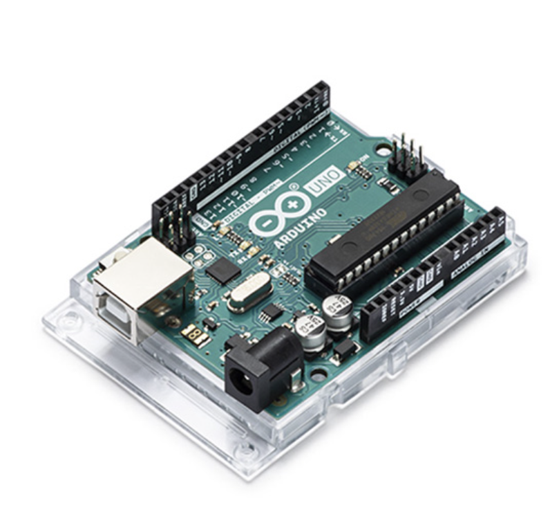
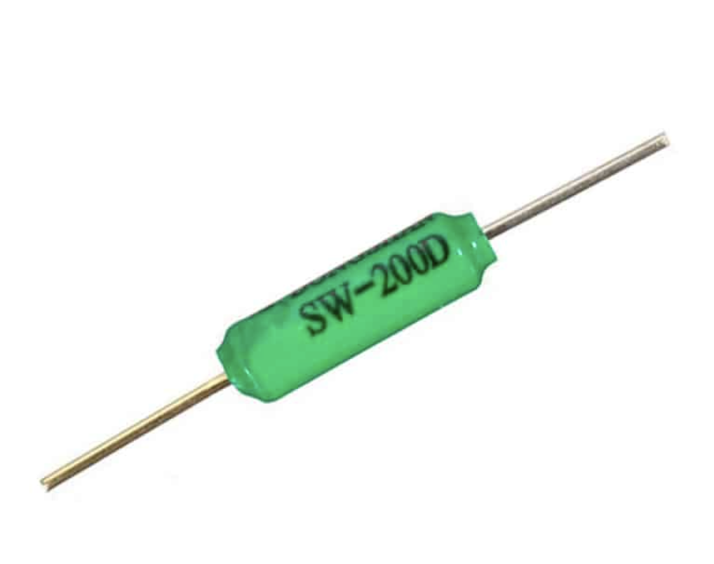
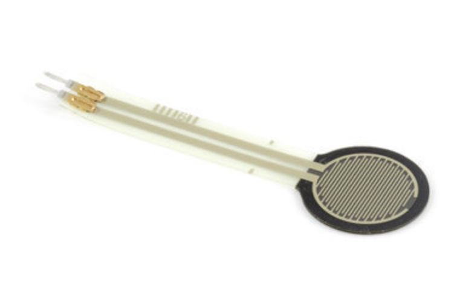
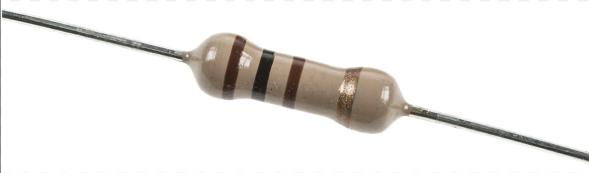
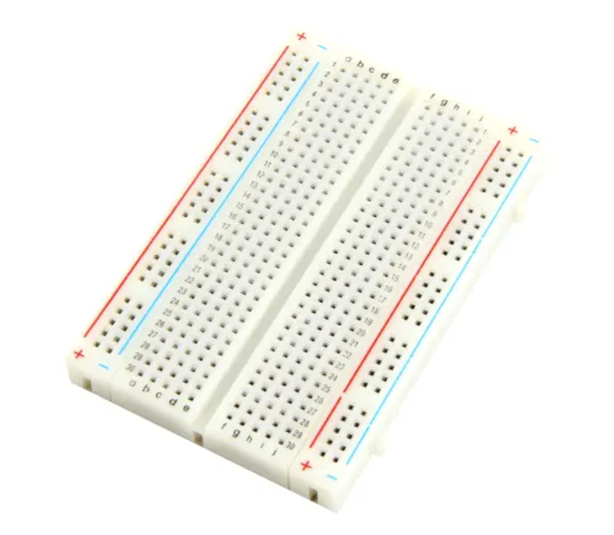
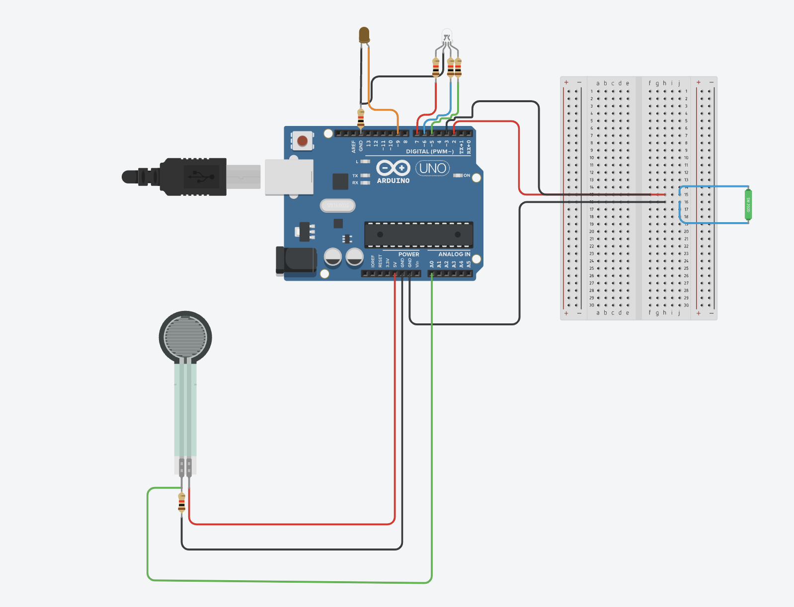
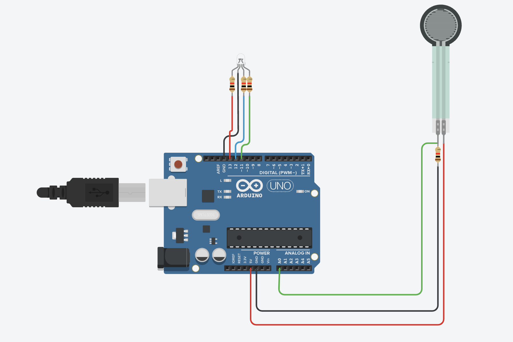
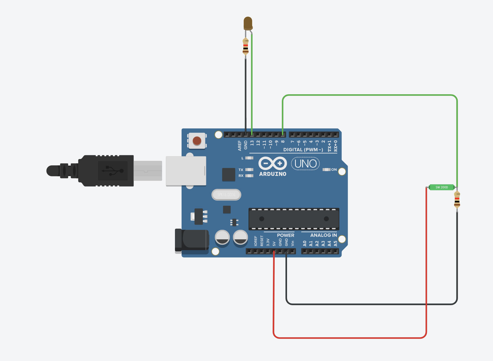

# iot-stay-hydrated
## Introduction
StayHydrated is a smart bottle which gives you the hability to track you water consumption, sends you reminders to drink some water or to refill your bottle because there isn't enough water left in it. 
### Team members
- [FLORAC Clara](https://github.com/Claraflo)
- [SANGARE Namizata](https://github.com/NamizataS)
- [STROCK Rebecca](https://github.com/StrockBecca)
- TRAN NGUYEN Nori

## How does our bottle work ?
There are two sensors in the bottle:
- An incline sensor to detect someone is drinking or not.
- At the bottom of the bottle, there's a pressure sensor which weights the amount of water left every 5 minutes or after the incline sensor gets back to it's original position. 

## Components
### Arduino Uno R3

### Tilt sensor SW200D

### Force sensor FSR02

### Resistor

### Breadboard

In our circuits, we use components which will not be necessary when we will actually build the product. The components are the following:
- LED
- LED RVB

## Circuits
We have three circuits:
- The [first](https://www.tinkercad.com/things/5ItJmCWBOBZ?sharecode=XSftYP_b0G_fvQe-uUdSAR046t7uExT2LwRnJIeHGHM) circuit gives us a general circuit with every components connected on one Arduino Uno

- The [second](https://www.tinkercad.com/things/bbWcaDoaCt5?sharecode=kCyK-jh5oeYqWXCZJu4dnO2jhIDBFJ8boLd1N_S26j4) circuit show us the measurement of the amount of water left alone

- The [third](https://www.tinkercad.com/things/bSIwsLyYK7V?sharecode=PWPDl2Op5l3thSK4mz4GwcmWcOPM40l4zH1gMNxd5K8) circuit show us the measurement of the tilt alone 
